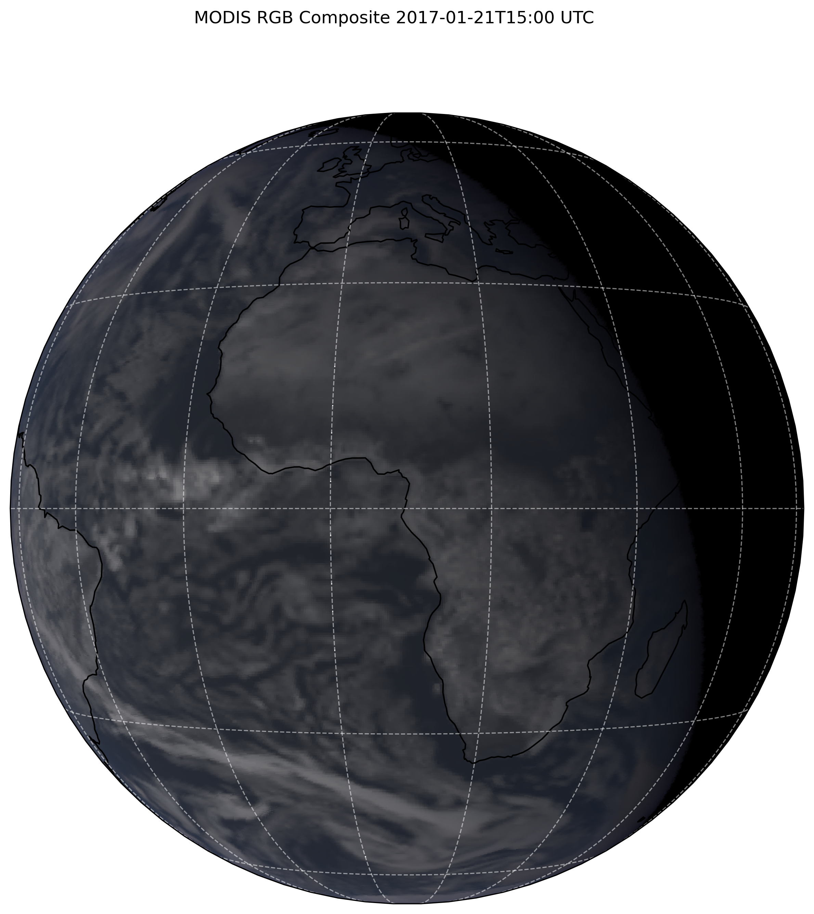

# ecRadOff
Framework for offline ecRad computations, supporting usage of the ecRad FLOTSAM version for simulating satellite spectral reflectances and radiances.

## Introduction
This is a wrapper utility to perform ecRad computations on ERA5-like fields.

## Clone
ecRad is a git submodule. For the Flotsam version, also Adept-2 and FLOTSAM are submodules, and all needed dependencies are built inside the repository. So you need to clone also the content of the submodules:
```
git clone --recurse-submodules <repository_url>
```
to use the ecRad FLOTSAM version, checkout the flotsam branch
```
git checkout flotsam
```

## Installation
This is still a work in progress, but with some effort should go through in most linux environments.

### Ptyhon virtual environment
It is recommended to use a virtual environment (tested Python 3.11, but should work with 3.8+).:
```
$ python3 -m venv .venv
$ source .venv/bin/activate
```

### Required system dependencies
- Fortran compiler, netCDF4, openMP
- *ONLY IF FLOTSAM IS USED*:
  - GNU compiler (gcc/g++ at the moment hardcoded for Flotsam)
  - BLAS/LAPACK libraries, you may need to set by hand the BLAS_LIB environment when invoking the build script

### Building libraries and ecRad
There is a python `setup.py` script to build all sources (ecRad and its dependencies, the native ecRadOff Fortran libraries). Python requirements are in `requirements.txt`. Ideally, everything should be handled automagically with:
```
$ pip install -e .
```
however, it is more probable than not that this will not work. While installing requirements with `pip install -r requirements.txt` should be no problem, `setup.py` is more likely not to collaborate much. You can invoke it directly and eventually fine-tune it to your needs and environment. To print available environment options:
```
$ python setup.py help
```
Then, to attempt a build with default options:
```
$ python setup.py build
```

###  Most-used environment variables
You can select the preferred ecRad profile from (`ecrad/Makefile.profile`) by setting the `PROFILE` environment variable. For example, 
```
$ PROFILE=profile python setup.py build
```
Similarly, you can use the switch for single-precision ecRad (`ECRAD_SP`). To set the number of threads for make, use `NUM_THREADS`, set to 0 for all available threads, default is single-threaded build.

### FLOTSAM debugging
If Flotsam is a required dependency, you can set the `FLOTSAM_DEBUG=1` and/or `FLOTSAM_MINIMAL_CHECKS=0` and/or `FLOTSAM_NAN_INIT=1` environment variables to override the default behaviours. These tell the builder to, respectively, enable dubug symbols, enable full checks on dimensions and boundaries, and enable NaN initialisation for real variables.

## Input fields
At the moment you need to fetch most of the input by yourself but soon there will be a CDS downloader or similar for MARS.

An up-to-date list of inputs is to be found at <https://confluence.ecmwf.int/display/ECRAD>

### Greenhouse gas climatology
Place it under `/data/ghg` and set the exact filename in `src/main/config` accordingly.
```
$ wget -q "https://confluence.ecmwf.int/download/attachments/70945505/greenhouse_gas_timeseries_CMIP6_SSP370_CFC11equiv_47r1.nc?version=1&modificationDate=1606823141142&api=v2&download=true" -O data/ghg/greenhouse_gas_timeseries_CMIP6_SSP370_CFC11equiv_47r1.nc
```

### Aerosol climatology
Same as above, download from ecRad page to `/data/aerosols` and with the filename set in `src/main/config` accordingly.


## Running
At the moment there is still no driver script, but you can directly use the exposed Python API to run computations. See the `introduction.ipynb` jupyter notebook example.

Most configuration options are in `src/main/config`, and it is ready to read configuration from a JSON file, examples will be provided soon.

## TMPDIR
The ecRadOff example in the Jupyter notebook saves input fields for ecRad in $TMPDIR by default, assuming that this is sufficiently fast and large (ideally RAM, but SSD is also great). Most of the time is indeed I/O from fields on disk, so having a fast (temporary) storage at disposal really speeds up every iteration.


